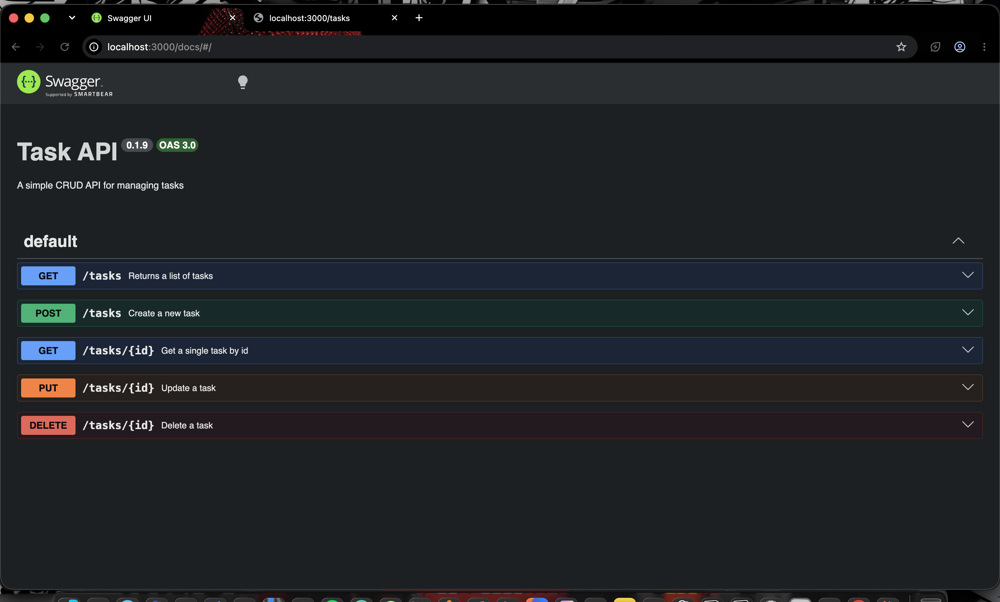

# Task API

A small CRUD API built with Node.js and Express that manages a to-do list — create, read, update, and delete tasks. Data is stored in memory (no database), so it resets whenever the server restarts.

## How to install & run

```bash
npm install
node server.js
```

The server starts on `http://localhost:3000`.

Interactive API docs (Swagger UI) are available at `http://localhost:3000/docs`.

## Endpoints

| Method | Path          | Description                          |
|--------|---------------|---------------------------------------|
| GET    | `/`           | API info (name, version, endpoints)   |
| GET    | `/health`     | Health check — confirms server is up  |
| GET    | `/tasks`      | List all tasks                        |
| GET    | `/tasks/:id`  | Get a single task by id               |
| POST   | `/tasks`      | Create a new task                     |
| PUT    | `/tasks/:id`  | Update a task's title and/or done     |
| DELETE | `/tasks/:id`  | Delete a task                         |

### Status codes used

- `200` — successful read/update
- `201` — task created
- `204` — task deleted (no content returned)
- `400` — invalid or missing input (e.g. empty title)
- `404` — task not found

## Example request

```bash
curl -i -X POST http://localhost:3000/tasks -H "Content-Type: application/json" -d '{"title":"Buy milk"}'
```

```
HTTP/1.1 201 Created
X-Powered-By: Express
Content-Type: application/json; charset=utf-8
Content-Length: 40
ETag: W/"28-PpSBYV7i68cXyGc7AhjVpkZkY5Q"
Date: Sun, 09 Aug 2026 01:32:31 GMT
Connection: keep-alive
Keep-Alive: timeout=5

{"id":4,"title":"Buy milk","done":false}%  
```

## Swagger UI



## AI vs me
 
**My prompt:**
 
i want you to create a CRUD API for a todo list using expressjs create a array with id title and done status (boolean) to store the tasks in the server not a database for now. make 5 endpoints, get/ task to give the list of tasks, get/task/:id to give that specific task if task id doesnt exists return 404 error, post/task to create a new task and create a next new id and set done to false, if title empty return 400 else if creaated 201, put/task/:id and replaces the title and status code 201 if invalid or empty body doesnt exist 400, 404 if id not known, delete/task/:id removes the task and 204 if unknown id 404, in the doc/ folder create a swagger ui with openai.json written with the five endpoints mentioned
 
The AI's code lives in `ai-version/` and was run separately from my hand-built implementation above.
 
### What did the AI do better?
 
The AI used an auto-incrementing `nextId` counter (`let nextId = 1; id: nextId++`) instead of `tasks.length + 1`. This avoids duplicate ids after a task is deleted and a new one is added — something my version doesn't handle correctly. It also validated that `title` is actually a string and trimmed whitespace, catching edge cases (like a number or blank title) that my version doesn't check for.
 
### What did it get wrong or quietly ignore?
 
- My prompt said PUT should return `201` on success, which is technically wrong (`201` means "created," not "updated") — but the AI followed my instruction literally instead of catching the mistake. A stricter or more careful AI might have flagged this.
- My prompt was ambiguous about whether PUT needs both `title` and `done`, or either one. The AI interpreted "replaces the title and status" as requiring **both** fields to be present, rejecting requests with only one — which is stricter than the CRUD assignment's actual spec (title **and/or** done).
- I never specified a module system, so the AI defaulted to CommonJS (`require`) while my hand-built version uses ES modules (`import`) — a silent, reasonable choice, but a real difference between the two codebases.
### What did my prompt forget to specify?
 
I didn't specify plural vs singular route names, so both my prompt and the AI's output ended up using `/task` instead of the assignment's required `/tasks` — this was actually my own prompt's mistake, not something the AI introduced. I also left the PUT status code instruction wrong in my own prompt (`201` instead of `200`), and didn't clarify whether partial updates (only title, or only done) should be allowed.
 
### Rematch — what changed
 
I revised my prompt to explicitly say: use `/tasks` and `/tasks/:id` (plural), allow PUT to update title and/or done independently (partial updates allowed), and return `200` (not `201`) on a successful update. After regenerating, the AI corrected all three issues — using the right plural paths, allowing partial updates, and returning the correct status code — which confirmed that being precise about small details in the prompt directly fixed the output, rather than the AI needing to "guess better."